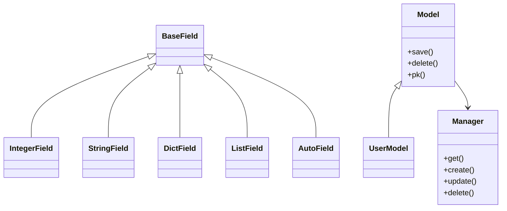
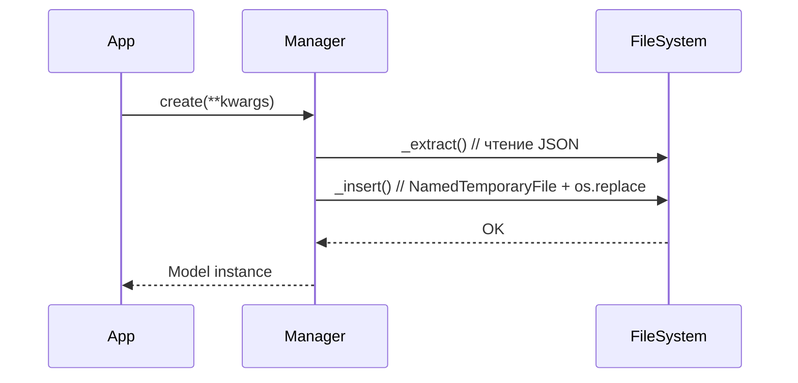

# Исследование технологии: микробаза данных на JSON (tinyjsondb)

## 1. Цель исследования

Целью исследования было понять, как можно с нуля реализовать простейшую систему управления базами данных (СУБД), хранящую данные в формате JSON. Кроме того, задача включала построение ORM-подобного интерфейса для удобного взаимодействия с моделью данных в стиле Django ORM.

В рамках проекта была реализована библиотека `tinyjsondb`, демонстрирующая принципы:

* декларативного описания схемы;
* управления первичными ключами;
* сериализации в JSON;
* безопасной конкурентной записи с блокировкой;
* работы через API `Model.objects.get/create/update/delete`.

---

## 2. Постановка задач

Для достижения цели были поставлены следующие задачи:

1. Реализовать класс `BaseField` и его производные (`IntegerField`, `StringField`, `AutoField` и др.),
2. Настроить генерацию схемы данных через метакласс `MetaModel`,
3. Построить универсальный класс `Model` для работы с объектами,
4. Реализовать CRUD-менеджер `Manager`,
5. Обеспечить сериализацию и десериализацию в JSON,
6. Добавить защиту от конкурентного доступа при записи,
7. Сформировать набор исключений для контроля ошибок.

---

## 3. Анализ предметной области

Перед реализацией были изучены следующие источники:

* **TinyDB** — Python-библиотека для хранения данных в JSON-файле,
* **Django ORM** — подход к работе с моделями и полями,
* **portalocker** — библиотека для безопасной блокировки файлов.

### Ключевые принципы:

* **Автогенерация `id`** — реализована через `AutoField`,
* **Менеджер `objects`** — шаблон доступа к данным,
* **Метаклассы** — автоматическая сборка схемы модели и привязка менеджера,
* **Безопасная запись** — через `portalocker` и `NamedTemporaryFile`.

---

## 4. Архитектура решения

### 4.1 Диаграмма классов



### 4.2 Последовательность операций `create()`



### 4.3 Пример структуры JSON-файла

```json
{
    "1": {
        "id": 1,
        "name": "Alice",
        "age": 30
    },
    "2": {
        "id": 2,
        "name": "Bob",
        "age": 25
    }
}
```

---

## 5. Ключевые решения и проблемы

| Проблема                         | Решение                                           |
| -------------------------------- | ------------------------------------------------- |
| Потенциальное повреждение файла  | Использование `NamedTemporaryFile` + `os.replace` |
| Одновременный доступ             | Блокировка через `portalocker`                    |
| Отсутствие первичного ключа      | Добавление `AutoField` по умолчанию               |
| Несовпадение схемы               | Метод `sync()` пересоздаёт недостающие поля       |
| Обращение к несуществующему полю | Исключение `FieldDoesNotExistError`               |

### Обработка ошибок

Реализованы собственные исключения для обработки ошибок в модели и при манипуляции объектами:

* `MissingPrimaryKeyError`
* `DuplicatePrimaryKeyError`
* `ObjectNotFoundError`

---

## 6. Пример использования

```python
from tinyjsondb import Model, IntegerField, StringField

class User(Model):
    id = IntegerField(primary_key=True)
    name = StringField()
    age = IntegerField()

User.sync()
User.objects.create(name="Alice", age=30)
print(User.objects.get(id=1).name)  # Alice
```

---

## 7. Вывод

В результате исследования разработана библиотека `tinyjsondb`, реализующая полноценную файловую микробазу с декларативным описанием моделей и ORM-подобным API. Это позволяет использовать её в учебных целях и небольших приложениях без установки полноценной СУБД.

Решение обладает высокой читаемостью, автономностью и простотой в установке, что делает его удобным для изучения основ баз данных, сериализации и проектирования API доступа к данным.
